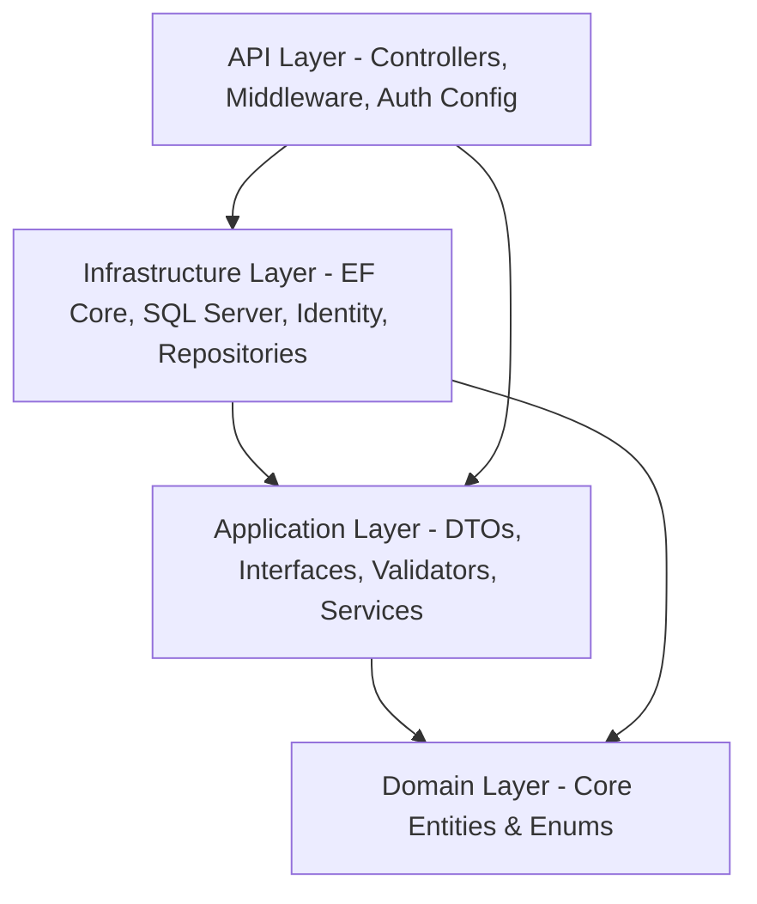

# Implementation Plan - E-Market E-Commerce Web Application

This document outlines the architectural design and step-by-step implementation plan for building **E-Market**, a production-ready e-commerce web application.

---

## Architecture Overview

We will use **Clean Architecture** for the backend to ensure a decoupled, testable, and maintainable codebase. The codebase is split into a **Backend** (.NET 8 Web API) and a **Frontend** (React.js + Tailwind CSS).

### Clean Architecture Layers (Backend)

- **Domain**: Contains enterprise logic, domain entities, base/common types, and enum types. Has zero dependencies on other layers or third-party libraries.
- **Application**: Contains application business logic, service interfaces, data transfer objects (DTOs), mappings (AutoMapper), request validators (FluentValidation), and database interfaces. Depends only on Domain.
- **Infrastructure**: Contains persistence logic (Entity Framework Core context, repository and Unit of Work implementations), Identity logic (ASP.NET Core Identity with JWT generation), and logging (Serilog setup). Depends on Application and Domain.
- **Api (Presentation)**: Exposes endpoints, handles request/response serialization, implements global error handling middleware, and configures Swagger/JWT Authentication. Depends on Infrastructure and Application.

---

## User Review Required

> [!IMPORTANT]
> - **Database**: We will use SQL Server LocalDB (`(localdb)\MSSQLLocalDB`) for the local development environment.
> - **JWT Authentication**: We will configure token security settings in `appsettings.json` with a 256-bit signing key.
> - **Admin Credentials**: An initial seed admin user will be created. The seeding logic will configure default products, categories, and roles.
> - **AI Voice Talk (Text-to-Speech)**: We will implement Text-to-Speech (TTS) using the browser-native HTML5 Web Speech Synthesis API (`window.speechSynthesis`).
>   - We will add a persistent toggle button (using `Volume2` and `VolumeX` icons) in the Chatbot widget header.
>   - By default, TTS will be disabled (muted) to prevent unexpected browser sound, but users can toggle it on with a single click.
>   - When active, the bot will speak all new bot replies, automatically cleaning up special formatting (e.g. markdown tags, links, and code structures) for clean audio playback.
>   - The speech engine will automatically cancel any queued utterances before starting a new one to prevent overlapping audio.

---

## Proposed Changes

### Component 1: Backend (ASP.NET Core 8 Web API)

The backend code will reside in `backend/src/`. We will create a .NET solution `EMarket.Solution.sln` containing four projects:

1. `EMarket.Domain` (Class Library)
2. `EMarket.Application` (Class Library)
3. `EMarket.Infrastructure` (Class Library)
4. `EMarket.Api` (Web API)

#### [NEW] [BaseEntity.cs](file:///E:/E-Commerce Web Application (E-Market)/backend/src/EMarket.Domain/Common/BaseEntity.cs)
Defines common properties for domain entities: `Id` (int), `CreatedAt` (DateTime), and `UpdatedAt` (DateTime?).

#### [NEW] [Domain Entities](file:///E:/E-Commerce Web Application (E-Market)/backend/src/EMarket.Domain/Entities/)
- `Product.cs`: Name, Description, Price, StockQuantity, ImageUrl, CategoryId, Brand, IsActive.
- `Category.cs`: Name, Description, ImageUrl, and relationship to Products.
- `Order.cs`: CustomerId, OrderDate, TotalAmount, Status (Enum), ShippingAddress, OrderItems, PaymentStatus, PaymentMethod.
- `OrderItem.cs`: OrderId, ProductId, Quantity, UnitPrice.
- `Cart.cs`: CustomerId, CartItems.
- `CartItem.cs`: CartId, ProductId, Quantity.
- `Review.cs`: ProductId, CustomerId, CustomerName, Rating (1-5), Comment, CreatedAt.
- `ApplicationUser.cs`: Inherits from `IdentityUser`, adds `FirstName`, `LastName`, `Address`, `City`, `PostalCode`, `Country`.

#### [NEW] [Application Core](file:///E:/E-Commerce Web Application (E-Market)/backend/src/EMarket.Application/)
- **Interfaces**: `IRepository<T>`, `IUnitOfWork`, `IJwtTokenGenerator`, `ICurrentUserService`, and application service interfaces (`IProductService`, `ICategoryService`, `ICartService`, `IOrderService`, `IAuthService`).
- **DTOs**: Authentication request/response records, product, category, cart, and order transfer schemas.
- **Mappings**: AutoMapper profile mapping domain entities to DTOs and vice versa.
- **Validators**: FluentValidation rules for requests (e.g. creating/updating products, login, registration).
- **Services**: Concrete business service classes that implement application workflows.

#### [NEW] [Infrastructure & Identity](file:///E:/E-Commerce Web Application (E-Market)/backend/src/EMarket.Infrastructure/)
- **Persistence**: `ApplicationDbContext` (extending `IdentityDbContext<ApplicationUser>`), repository implementations, and `UnitOfWork`.
- **Identity & Security**: `JwtTokenGenerator` using JWT Bearer authentication, and `IdentityService` to manage user registrations, logins, and roles.
- **Seed Data**: `SeedData.cs` class to initialize default roles (`Admin`, `Customer`), seed an admin user, and generate mock categories and products.

#### [NEW] [API Layer](file:///E:/E-Commerce Web Application (E-Market)/backend/src/EMarket.Api/)
- **Controllers**:
  - `AuthController.cs`: Endpoints for register, login, current profile, and user credentials.
  - `ProductsController.cs`: CRUD operations (Admin-protected for write operations, public for read operations).
  - `CategoriesController.cs`: CRUD operations for product categories.
  - `CartController.cs`: Get cart, add/update/remove items.
  - `OrdersController.cs`: Create order, get user orders, get all orders (Admin), update order status (Admin).
- **Configuration**:
  - Serilog logging configuration in `appsettings.json` and `Program.cs`.
  - CORS policy allowing the React frontend domain.
  - Global error handling middleware to catch exceptions and return standardized error objects.

---

### Component 2: Frontend (React.js + Tailwind CSS)

The frontend code will reside in `frontend/`. It will be set up using Vite with React, Tailwind CSS, Axios, and React Router.

#### [NEW] [Vite and Tailwind Config](file:///E:/E-Commerce Web Application (E-Market)/frontend/)
Initializes the package structure with dependencies: `react-router-dom`, `axios`, `lucide-react` (icons), and `tailwindcss` configuration.

#### [NEW] [Services & Authentication State](file:///E:/E-Commerce Web Application (E-Market)/frontend/src/services/)
- `api.js`: Set up Axios instance with base URL. Add interceptor to automatically read JWT token from local storage and include it as authorization header.
- `AuthContext.jsx`: Context provider for user session details (user login, registration, logout, checking active role).
- `CartContext.jsx`: Context provider for shopping cart items, computing subtotals, loading cart from API for registered users, and storing in local storage for guest state (synced upon registration/login).

#### [NEW] [Premium Web Pages](file:///E:/E-Commerce Web Application (E-Market)/frontend/src/pages/)
- `Home.jsx`: Modern interface with carousel, top categories, trending products list, and promotional banners.
- `Shop.jsx`: Dynamic shopping interface with pagination, robust sidebar filters (categories, price sliders, stock status), search query inputs, and sorting selectors.
- `ProductDetails.jsx`: Full layout showing product specifications, reviews list, rating distribution, stock count, and quantity add-to-cart control.
- `Cart.jsx`: Visual item list, item quantity selectors, price computation breakdown, and checkout action buttons.
- `Checkout.jsx`: Single-page checkout collecting customer delivery parameters, payment method selection, and showing payment summary.
- `OrderHistory.jsx`: Interactive list displaying previous order receipts and delivery stages.
- `Login.jsx` & `Register.jsx`: Premium styling forms featuring smooth inputs, validation errors, and loader indicators.
- `AdminDashboard.jsx`: Dedicated admin zone for inventory management (Add/Edit Products, Categories) and order fulfillment (Change order status to Processing, Shipped, Delivered).

#### [NEW] [UI & Shared Components](file:///E:/E-Commerce Web Application (E-Market)/frontend/src/components/)
- `Navbar.jsx`: Premium glassmorphism top navigation with a sliding cart panel, live badges, and profile action popovers.
- `Footer.jsx`: Modern styling footer containing legal, product links, and newsletter signup.
- `ProductCard.jsx`: Elegant overlay card with stock badges, action triggers, and transition zoom states.
- `ProtectedRoute.jsx`: Routing wrapper to secure client-only pathways.
- `AdminRoute.jsx`: Routing wrapper securing admin pages.

---

## Verification Plan

### Automated Tests
We will perform verification by testing compilation, migration execution, and backend functionality:
- Run `dotnet build` from the backend solution directory to confirm compilability.
- Run `dotnet ef migrations add InitialCreate` and `dotnet ef database update` to ensure EF Core models map cleanly to SQL LocalDB.
- Launch the API using `dotnet run --project backend/src/EMarket.Api` and review the Swagger UI to check API routing and configurations.

### Manual Verification
- We will start the backend server and frontend development server simultaneously.
- Verify JWT Authentication works: register a new customer user, log in, verify JWT token persistence, and test authorization guards.
- Verify Product Catalog operations: fetch categories and products, filter and search products.
- Verify Cart flow: add products, modify quantities, review cart total.
- Verify Checkout and Order placement: submit delivery forms and place orders, check stock updates, and view orders in order history.
- Verify Admin Operations: log in with Admin role, add a new product with an image, update a product's price, update order status, and delete a category.
- Verify Chatbot Voice (Speech-to-Text & Text-to-Speech):
  - Toggle the voice output (speaker icon) in the chatbot header to enable speech synthesis.
  - Speak or type a message and check that the AI assistant responds by reading the message aloud.
  - Test toggling it back off (mute) to confirm that speech immediately stops.
- Inspect design responsiveness and aesthetics under standard resolutions and mobile views.
